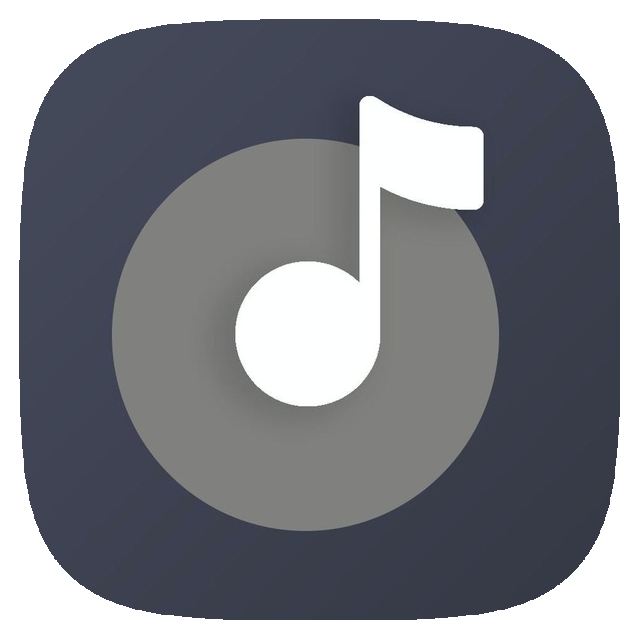

# **[Halio][Design]**

    

*Сервис для прослушивания музыки на iOS. Сделано в команде на `SWIFT MARAPHON 4.0`*

### ТЗ: 
* Приложение должно работать беря музыку из любого открытого API. 

* Минимальная версия iOS 13, пишем на UIKit, можно верстать как угодно.

*  Музыка должна проигрываться в фоновом режиме при сворачивании приложения.

* Экран 4 - делается по желанию.

* Архитектура любая на ваш выбор, всё остальное делаете тоже по своему вкусу )

- Дизайн: [Design]
- Ресурсы: [Resources]
- API: [API]

[Design]: https://www.figma.com/file/M25QcMrolpS8wzSqoYPFzI/halio-lalekan?node-id=0%3A28
[Resources]: https://www.sketchappsources.com/free-source/4159-halio-sketch-freebie-resource.html
[API]: https://developer.jamendo.com/v3.0/docs
